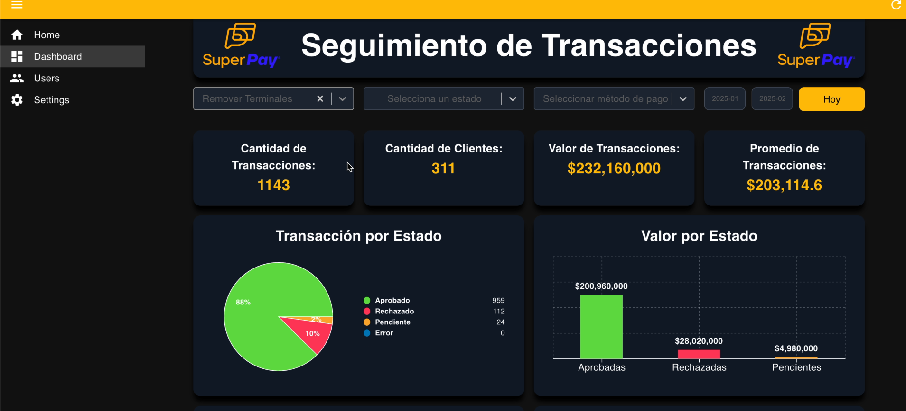

# 📊 SuperPay Backoffice Dashboard

This is a **frontend** interface built with **React** that powers the dashboard of **SuperPay**, a payment platform allowing users to access dynamic reports and transaction visualizations.

## How it looks

**Video**🔗 [Ver video en YouTube](https://youtu.be/Lcbw3K9EEy8)

---

## 🎯 Purpose

To build a modern, responsive dashboard for **SuperPay users** to view and analyze their business transaction data in real time.

---

## 🧩 Problem It Solves

Merchants often need quick access to customized reports of their payment activity. This dashboard allows:

- Access to detailed metrics of completed transactions.
- Filtering by terminal, payment method, transaction status, and date range.
- Interactive chart visualizations for better insights.

---

## 🚀 Key Features

- 📅 Date range filtering with a date picker.
- 🧾 Filter by payment method (e.g., Nequi, Redeban, etc.).
- 🏧 Filter by terminal.
- ✅ Filter by transaction status (approved, declined, pending).
- 📊 Real-time charts and stats based on filters.
- 🔄 Dynamic summaries generated from filtered data.

---

## 🛠️ Technologies and Tools Used

This is a **frontend-only** project. Key technologies:

### Languages & Frameworks
- [React](https://reactjs.org/) — Main framework
- [react-select](https://react-select.com/) — Customizable multiselect components
- [react-datepicker](https://reactdatepicker.com/) — Modern date picker
- [Recharts](https://recharts.org/en-US/) — Responsive charting library
- [Pure CSS](https://developer.mozilla.org/en-US/docs/Web/CSS) — Custom styles
- [react-admin](https://marmelab.com/react-admin/) — Sidebar menus and navigation
